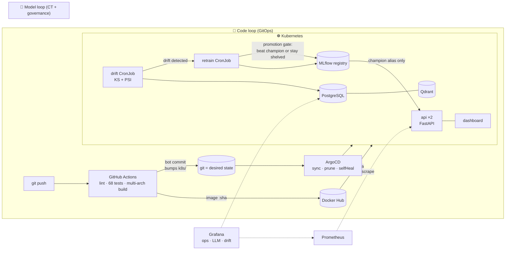
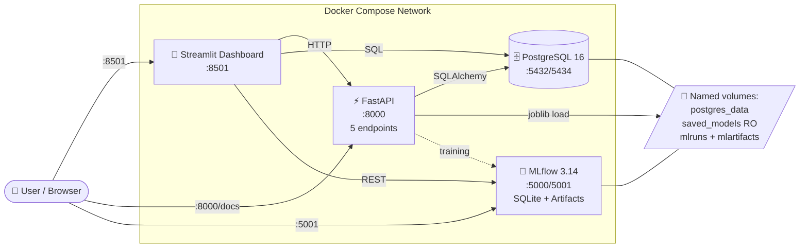
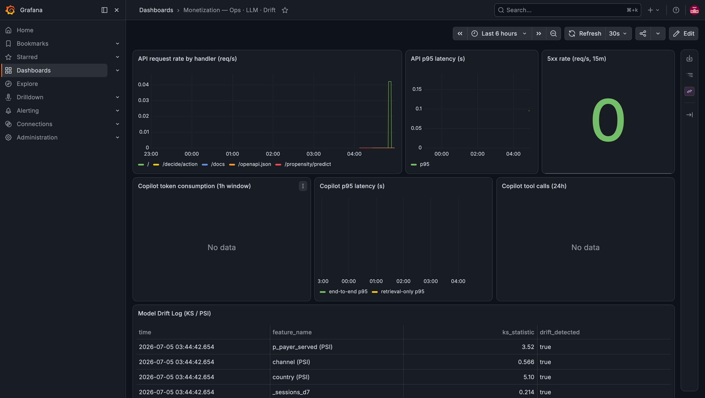
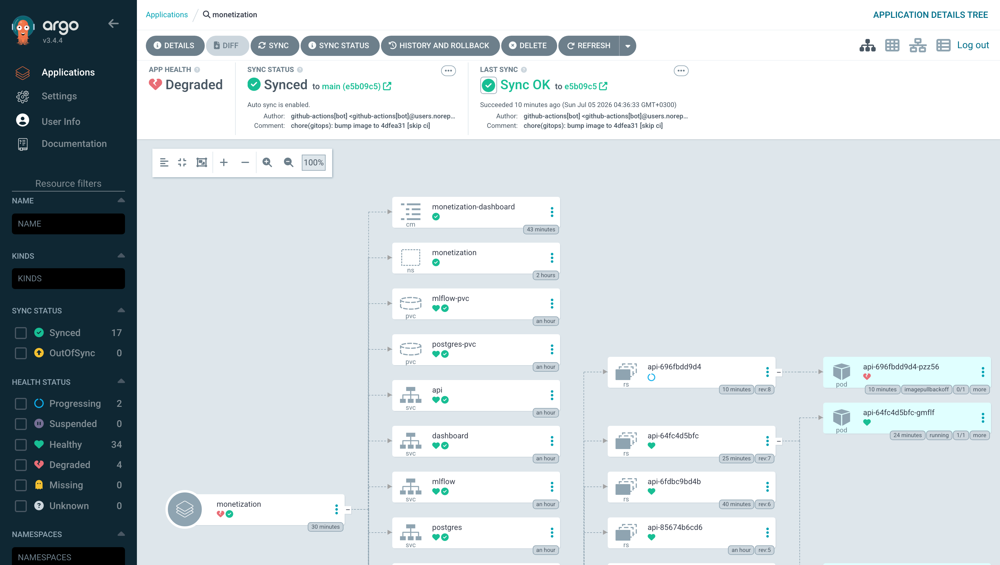
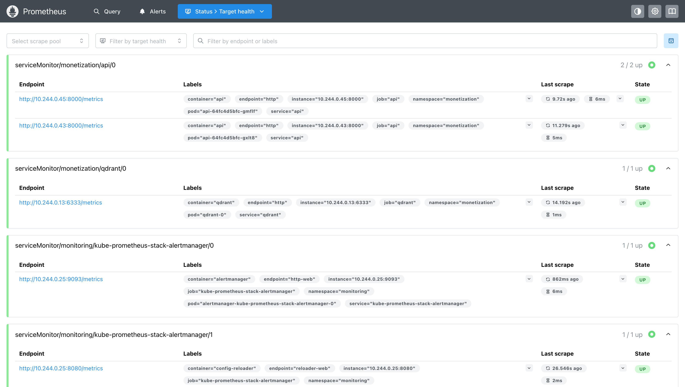
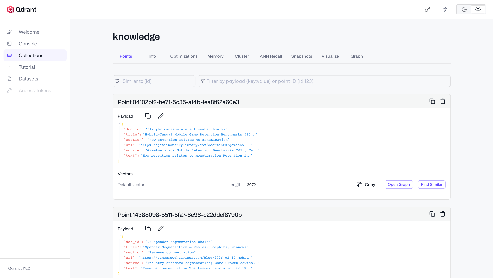
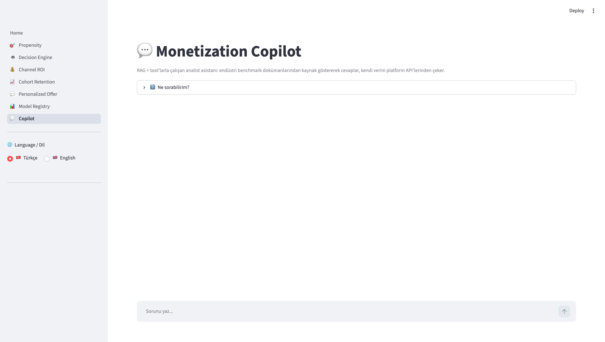
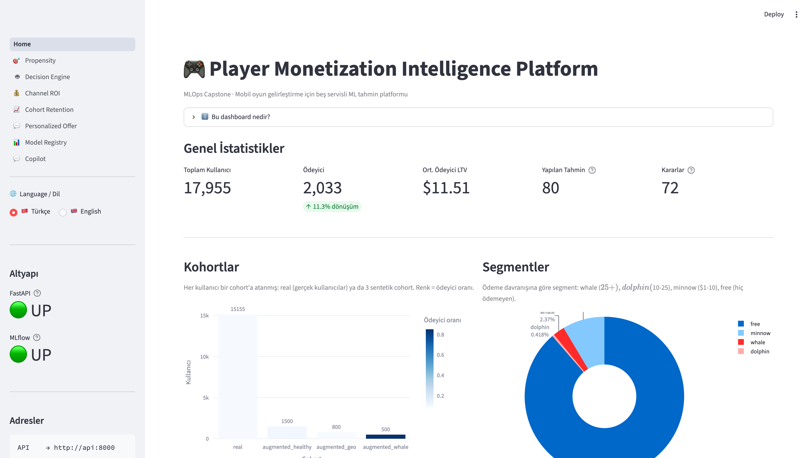

# 🎮 Player Monetization Intelligence Platform

[](https://github.com/ozkyunus/MLOps_Capstone/actions/workflows/ci.yml)
[](https://github.com/ozkyunus/MLOps_Capstone/actions/workflows/evals.yaml)


An end-to-end **MLOps platform** for mobile-game monetization: calibrated
two-tower pLTV models governed by a champion/challenger registry, a decision
engine, an agentic RAG copilot with eval gates — running on Kubernetes with
ArgoCD GitOps, drift-triggered continuous training, and full observability.



> **📖 Read this first**: The pipeline is production-shaped, but the ML signal
> is constrained by the public datasets used. See **[Limitations & Lessons
> Learned](#-limitations--lessons-learned)** — the honest audit is the most
> valuable part of this repo.

---

## 🎯 What It Does

Five FastAPI endpoints exposing an end-to-end monetization stack for a
mobile-game backend, plus a Streamlit dashboard that consumes them:

| # | Service | Endpoint | Output |
|---|---|---|---|
| 1 | **Calibrated pLTV** (two-tower) | `POST /propensity/predict` | `p_payer` (isotonic-calibrated), `pLTV` with non-payer gating |
| 2 | **Decision Engine** | `POST /decide/action` | argmax expected revenue over {SHOW_IAP, SHOW_AD_REWARDED, SHOW_AD_INTERSTITIAL, SKIP} |
| 3 | **Channel ROI** | `GET /channel/roi` | Per-channel CPI, observed ROAS, payback estimate |
| 4 | **Cohort Retention** | `GET /cohort/retention?dim=...` | D1/D7/D30 proxy retention vs industry benchmarks |
| 5 | **LLM Offer Copy** | `POST /personalized/offer` | Gemini-generated title / body / CTA (fallback templates when no key) |
| 6 | **Monetization Copilot** | `POST /copilot/chat` | Agentic RAG analyst assistant: cites a real benchmark corpus (Qdrant) AND calls the platform's own APIs as tools; full telemetry per turn |

---

## 🏆 Headline Metrics (After Audit + Fixes)

All v2.1 numbers are measured **strictly on the held-out test split persisted
in the model bundle at training time** — see Limitations §9 for why that
qualifier matters.

| Metric | v1 (leaky) | v3.1 (honest: held-out test · observable features · calibrated generator) |
|---|---|---|
| Test AUC (combined) | 0.898 ⚠ *inflated* | **0.64** |
| Test AUC (real cohort) | 0.915 ⚠ *leakage* | **0.57** — demographics only, no telemetry |
| Test AUC (synth cohorts) | ~0.90 | **0.75 – 0.82** — production-realistic |
| Brier score | 0.114 | **0.095** |
| Max calibration Δ | **0.40** *(broken)* | **0.044** |
| Mean predicted P | 0.33 (vs actual 0.11 — 3× off) | **0.111 vs 0.113 ✓** |
| Whale test n | 8 (useless) | **64** (CI ±$3.57) |
| Non-payer served pLTV | $0.55 | **median $0** (gated; mean $0.34 from FP tail) |

Full audit in `scripts/final_review.py` (exits non-zero on hard failures),
calibration plot at `saved_models/calibration_curve.png`.

---

## 🚀 Quick Start

**Honest prerequisites** — two things are deliberately NOT in git, so a fresh
clone needs a one-time setup before the stack is fully alive:
- **Raw datasets** (`data/raw/*.csv`) — excluded for size + licensing.
  Sources: Kaggle *Marketing Freemium Game* + Firebase *Flood It!* sample
  (see Citations at the bottom). Place the CSVs under `data/raw/`.
- **Model artifacts** (`saved_models/*.joblib`) — produced by the training
  step below; predict endpoints return errors until they exist.

```bash
git clone <this-repo> && cd MLOps_Capstone
cp .env.example .env          # REQUIRED: set POSTGRES_PASSWORD (compose
                              # refuses to start without it), keep the same
                              # password inside SQLALCHEMY_DATABASE_URL

# 1 — infrastructure (Postgres + MLflow + API + dashboard containers)
docker compose up -d --build  # first build ~5-8 min (SDV + XGBoost deps)

# 2 — one-time data pipeline (host-side, talks to localhost:5434)
uv sync
uv run python -m scripts.load_real_data           # CSVs → Postgres
uv run python -m src.synthetic.user_augmentation  # calibrated SDV synthesis
uv run python -m scripts.build_features           # → user_features_d7

# 3 — train both towers (≈1 min total; logs to MLflow, saves joblib bundles)
uv run python -m src.ml.train_propensity
uv run python -m src.ml.train_ltv
curl -X POST http://localhost:8000/admin/reload-models   # hot-swap, no restart

# 4 — explore
open http://localhost:8501        # 🎨 Streamlit dashboard  (main UI)
open http://localhost:8000/docs   # 📖 FastAPI Swagger
open http://localhost:5001        # 🧪 MLflow tracking + registry

# Control
curl http://localhost:8000/readyz   # dependency-aware readiness check
docker compose logs -f api          # tail API logs
docker compose down                 # stop (KEEPS the Postgres volume)
docker compose down -v              # stop + wipe data (true fresh start)
```

## 🛠 Bare-metal dev loop (API/dashboard outside Docker)

```bash
docker compose up -d postgres mlflow    # infra containers only

uv run uvicorn src.main:app --port 8000 --reload
uv run streamlit run dashboard/Home.py --server.port 8501

# Audits (rerun after every retrain)
uv run python -m scripts.audit_models   # calibration_curve.png, held-out only
uv run python -m scripts.final_review   # 10-section review, exits 1 on failure
uv run pytest                           # 60+ tests (integration auto-skips
                                        #   without Postgres + models)
```

---

## 🏗 Architecture

### High-level (Docker Compose stack)



### ML pipeline (two-tower pLTV with calibration + gating)

```
user_features_d7 (17.955 rows in Postgres)
        │
        ▼
┌──────────────────────────────────────┐
│ STAGE 1  ·  propensity_model         │
│ XGBoost (natural class weights)      │
│  + CalibratedClassifierCV(isotonic)  │────► p_payer ∈ [0, 1]  (trustworthy)
│ trained on ALL 17.955 users          │
└──────────────────────────────────────┘
        │
        ▼
┌──────────────────────────────────────┐
│ STAGE 2  ·  ltv_model                │
│ XGBoost + Huber loss                 │
│ segment sample_weights               │
│  (whale=4, dolphin=2, minnow=1)      │────► E[LTV | payer]  ($)
│ trained ONLY on payers  (n=2.247)    │
└──────────────────────────────────────┘
        │
        ▼
   pLTV_raw = p_payer × E[LTV | payer]
        │
        ▼
┌──────────────────────────────────────┐
│  Cohort-aware Gate                   │
│  real  cohort: threshold 0.10        │
│  synth cohort: threshold 0.20        │
│  if p_payer < threshold → pLTV = 0   │
└──────────────────────────────────────┘
        │
        ▼
   pLTV (served value) ── PredictionLog ──► audit trail
```

**Why calibrated**: v1 used `scale_pos_weight=8` for recall, over-inflating
probabilities 3× (mean predicted 0.33 vs actual rate 0.11). Decision Engine
used `p_payer × price` for expected revenue → always picked SHOW_IAP → would
tank retention. `CalibratedClassifierCV(method='isotonic', cv='prefit')` on
the validation set restores trustworthy probabilities.

**Why gated**: LTV model was trained only on payers. Predicting LTV for
non-payers is out-of-distribution noise. Gating forces `pLTV = 0` for users
the propensity model isn't confident about — Decision Engine then falls
back to ads instead of showing a marginal IAP.

**IAP eligibility layer** (`decide.py`): even after gating, the Decision Engine
requires `p_payer ≥ IAP_MIN_P_PAYER (0.25)` before showing an IAP offer.
Below that threshold IAP expected-revenue is zeroed out and the argmax picks
a rewarded ad. Without this the math (14% × $0.99 vs $0.015 rewarded ad
revenue) trivially favored IAP for every user — a retention killer.

---

## ☸️ Kubernetes, GitOps & Observability

The full stack runs on Kubernetes (Docker Desktop, kind provisioning) with a
complete GitOps + monitoring layer on top:

```
Docker Desktop Kubernetes
├─ namespace: monetization
│   ├─ postgres    Deployment+PVC (Recreate; imperative Secret — never in git)
│   ├─ qdrant      StatefulSet + volumeClaimTemplate (+native /metrics)
│   ├─ mlflow      Deployment+PVC (--workers=1 after an OOMKill lesson)
│   ├─ api         Deployment ×2 · startup/readiness/liveness probes ·
│   │              /readyz gates traffic on DB+models · resource budgets
│   ├─ dashboard   Deployment (same image, Streamlit command)
│   └─ drift-check CronJob (daily KS/PSI → driftlog table)
├─ namespace: argocd      — watches k8s/ on main: automated + prune + selfHeal
└─ namespace: monitoring  — kube-prometheus-stack:
      ServiceMonitors (api, qdrant) · Grafana dashboards AS CODE (ConfigMap)
      · Postgres datasource provisioned as a Secret for the drift panel
```

**The GitOps loop**: push to main → CI lints/tests → builds + pushes
`docker.io/ozkyunus/monetization-api:<short-sha>` → a bot commit bumps the
image tag in `k8s/*.yaml` → ArgoCD reconciles → rolling update. Humans
change the cluster by opening PRs; `kubectl apply` is a robot's job.

### Battle scars (every one now encoded in the manifests)

1. **MLflow OOMKilled loop** — 3.x defaults to 4 uvicorn workers; blew the
   1Gi limit (exit 137). Fix: `--workers=1` + realistic limits.
2. **kind NodePorts aren't host-reachable** on Docker Desktop → services use
   `LoadBalancer` (cloud-provider-kind binds them to localhost).
3. **Dropped in-cluster ports** — adding host ports (5434/5001) while
   removing 5432/5000 took down every in-cluster client behind
   mlflow-client's 7-retry backoff. Services now expose BOTH.
4. **Probes vs slow ML startup** — liveness killed pods mid-model-load
   (CrashLoopBackOff). Fix: warm-up in lifespan + `startupProbe` (the
   canonical pattern for slow-starting ML containers). Fresh pods: 0
   restarts, ready in ~10s.
5. **UI-built Grafana dashboards die with the pod** (no persistence) —
   hence dashboards-as-code in a ConfigMap the sidecar auto-loads.
6. **selfHeal enforced its rule on us**: a Grafana ConfigMap hotfix applied
   with `kubectl` (bypassing git) was silently REVERTED by ArgoCD within a
   minute — the correct fix was committing to git and letting it sync.
   GitOps means the robot outranks your terminal.
7. **Multi-arch or it didn't happen**: CI's first Docker Hub image was
   amd64-only; the Apple Silicon kind node refused it ("no match for
   platform"). Kubernetes stalled the rollout SAFELY — old pods kept
   serving (60/60 requests OK during the incident), the bad image never
   received traffic. Fix: QEMU + `platforms: linux/amd64,linux/arm64`.
   (Second lesson from the same job: a dual-arch ML image overflows the
   hosted runner's ~14GB free disk — drop unused toolchains first.)
8. **Models are not code**: the first CI-built image passed every check,
   then failed readiness in the cluster — `saved_models/` is gitignored
   (100MB+), so the registry-built image shipped model-less; the local
   image had only worked because the dev machine's build context included
   the artifacts. Fix: `load_models()` pulls the newest registered version
   from the MLflow registry at startup — the image carries only code, the
   registry is the model's home. Verified from an empty directory: the
   version label flipped from the `local-*` fallback to registry `v1`.

### GitOps loop — recorded evidence

```
$ git push                                  # human commit 4dfea31
CI: lint ✓ → pytest ✓ → build+push ✓        # docker.io/ozkyunus/monetization-api:4dfea31
bot: e5b09c5 "chore(gitops): bump image to 4dfea31 [skip ci]"
ArgoCD: Synced → revision e5b09c5           # cluster reconciled to the BOT's commit
rolling update: 60/60 curl probes OK        # zero downtime measured during rollout
$ kubectl get pods -l app=api               # serving image: docker.io/ozkyunus/...:4dfea31
```

### Continuous Training + model governance (the loop that closes the loop)

Drift detection that nobody acts on is a dashboard, not MLOps. Two pieces
close the loop:

1. **Champion/challenger governance** (`src/ml/promotion.py`): serving never
   loads "the newest" model — it loads the MLflow version carrying the
   **`champion` alias**. A freshly trained candidate earns that alias only by
   beating the incumbent on the held-out metric (AUC for propensity, MAE for
   LTV, with noise tolerance). A degraded retrain stays in the registry as a
   recorded experiment and **cannot reach production**.
2. **Drift-triggered retraining** (`src/retrain/run.py`, weekly CronJob):
   reads the latest `driftlog` batch → clean means exit, drift means retrain
   both models against the in-cluster MLflow → the promotion gate decides →
   on success the API's `/admin/reload-models` hot-swaps the champions with
   zero pod restarts.

Recorded live run:

```
🔁 Retraining triggered (drift in: p_payer_served (PSI), country (PSI))
👑 propensity_model v3 PROMOTED — test_auc: 0.6374 vs champion 0.6374 (tol 0.005)
👑 ltv_model v2 PROMOTED — test_mae: 7.8611 vs champion 7.8611 (tol 0.5)
✓ Continuous-training cycle complete.
```

**Honest framing**: this is a single-node cluster; the goal is operational-
pattern fidelity, not real distribution. On EKS/GKE the deltas would be:
managed Postgres (or CloudNativePG), a real LoadBalancer/Ingress + TLS,
external secret management (Vault/ESO), multi-node scheduling and HPA.

## 🤖 Monetization Copilot (RAG + LLMOps)

An analyst-facing chat service (`/copilot/chat`, dashboard page 💬) that
grounds answers in a **real, attributed knowledge corpus** and the
platform's **own live data**:

- **Agentic RAG**: Gemini flash-lite with an explicit tool loop (max 4
  rounds) over 5 tools — `search_knowledge_base` (Qdrant, 21 chunks from
  curated benchmark/policy/platform docs in `knowledge/`),
  `get_channel_roi`, `get_retention`, `predict_pltv`, `draft_offer_copy`.
  The model picks per-question: doc questions retrieve, data questions call
  tools, mixed questions do both, out-of-scope gets a canonical refusal.
- **Every turn is telemetry**: answer + citations + tool trace + token
  counts + latency → `copilot_log` (the LLM analogue of PredictionLog) +
  custom Prometheus metrics → the Grafana LLM panel.
- **Versioned prompts**: the system prompt lives at `prompts/copilot_v1.md`;
  every response and log row carries `prompt_version`.
- **Evals as the test set** (`evals/`): a 14-case golden set (doc / data /
  mixed / refusal) measured three ways — retrieval hit rate, deterministic
  behavior checks, and LLM-as-judge faithfulness. Scores log to MLflow;
  a CI eval gate (`.github/workflows/evals.yaml`) runs the no-DB subset on
  PRs touching prompts/agent/corpus + nightly. Baseline: retrieval 1.0,
  all completed cases passing.

### LLMOps field notes — what the free tier taught us

1. **Managed APIs shift under you**: Google retired `text-embedding-004`
   mid-build (404 at ingest). Models are dependencies — pin and verify.
2. **Quota is an architectural constraint**: `gemini-2.5-flash`'s free tier
   is 20 requests/day — one eval run consumed it. Everything moved to
   `flash-lite` (separate, larger bucket). Model choice = quota budget.
3. **Evals must separate "model is wrong" from "API is limited"**: 429/503s
   are marked ⚠ ERROR, never ✗ FAILED; the runner paces requests and one
   flaky call can't kill the run.
4. **Test traffic ≠ production telemetry**: evals call the agent directly —
   `copilot_log` and the Grafana panels only ever see real usage.
5. Production deltas: billed tier, request queueing, response caching,
   model fallback chains.

## 📸 Screenshots

### Kubernetes era (v2 — current stack)

| | |
|---|---|
|  **Grafana — Ops · LLM · Drift** (dashboard-as-code) |  **ArgoCD** — the app tree, Synced/Healthy |
|  **Prometheus targets** — api ×2 + qdrant UP |  **Qdrant** — the RAG knowledge collection |
|  **Copilot chat** (K8s-served) |  **Dashboard Home** (K8s-served) |

### Streamlit Dashboard

**Home — platform overview**

Live KPIs (17.955 users, 12.5% conversion, average payer LTV), cohort × payer-rate
bar, segment pie, MLflow registry mirror, and the audit trail of recent predictions.

**Propensity + pLTV**

User-picker sidebar (cohort × segment filters). Ground truth vs model prediction,
gate visualization (raw vs served pLTV), diagnostics panel showing the F1-optimal
threshold and gate state.

**Decision Engine**

argmax over `{SHOW_IAP, SHOW_AD_REWARDED, SHOW_AD_INTERSTITIAL, SKIP}` with
context modifiers and ad-fatigue penalty. Horizontal bar chart shows the
expected revenue of every alternative — the chosen action highlighted in dark.

**Channel ROI**

Blended KPIs on top, per-channel table below, four side-by-side charts
(installs vs revenue, ROAS with breakeven reference line, payback days,
conversion rate).

**Cohort Retention**

D1 / D7 / D30 proxy retention per cohort (channel / country / platform),
grouped bars with dashed lines for industry benchmarks. Explicit "PROXY"
disclaimer at the bottom.

**Personalized Offer (LLM)**

Segment + context → offer copy card (title, body, CTA button preview),
source badge (`llm` / `cache` / `fallback`).

**Model Registry**

MLflow registered models + full run history with metrics.

**Metric trend across runs**

Interactive time-series of any test metric across all training runs —
lets you see v1 → v2 improvements visually.

**Calibration reliability diagram**

v1 (broken, `scale_pos_weight=8`) vs v2 (isotonic-calibrated) probability
calibration. Diagonal = perfect. This chart is our honesty artifact —
same PNG lives at `saved_models/calibration_curve.png`, regenerated by
`scripts/audit_models.py`.

### FastAPI

**Swagger UI at `/docs`**

Interactive OpenAPI documentation — every endpoint is testable inline
without external tooling.

---

## 🧰 Stack

| Layer | Tech |
|---|---|
| **API** | FastAPI + SQLModel + uvicorn |
| **ML** | XGBoost (classifier + regressor), scikit-learn `CalibratedClassifierCV` (isotonic + `FrozenEstimator`), Huber loss with segment sample weights, Tweedie GLM as alternative architecture. All preprocessing (top-N bucketing, one-hot, imputation) lives in a `ColumnTransformer` fitted at train time and shipped **inside** the served Pipeline — train/audit/serving share one artifact, zero re-implementation |
| **Tracking / Registry** | MLflow 3.14 (SQLite backend, `--serve-artifacts`) |
| **Data** | PostgreSQL 16 (Docker), real backbone from Kaggle *Marketing Freemium Game* + Firebase *Flood It!*, synthetic augmentation via SDV `GaussianCopulaSynthesizer` |
| **UI** | Streamlit + Plotly + bilingual toggle (🇹🇷 / 🇬🇧) |
| **LLM** | LangChain + Google Gemini 2.5 Flash, with 12 offline fallback templates |
| **RAG / LLMOps** | Qdrant (dedicated vector store), Gemini embeddings, versioned prompts, 14-case golden set with retrieval/behavior/LLM-judge evals, CI eval gate, per-turn telemetry (tokens/latency/tools) in `copilot_log` |
| **Runtime** | **Kubernetes** (Docker Desktop kind): Deployments, StatefulSet, CronJob, probes incl. startupProbe, LoadBalancer services, imperative Secrets. Docker Compose kept as the lightweight alternative |
| **GitOps / CD** | **ArgoCD** (automated sync + prune + selfHeal) watching `k8s/`; GitHub Actions builds → pushes SHA-tagged images to **Docker Hub** → bumps manifests back into git |
| **Observability** | **kube-prometheus-stack**: ServiceMonitors (api + qdrant), ops golden signals, custom LLM metrics, dashboards-as-code (ConfigMap), drift CronJob writing `driftlog` surfaced in Grafana via a provisioned Postgres datasource |
| **Deps** | `uv` (Astral) |

---

## 📁 Project Structure

```
MLOps_Capstone/
├── src/
│   ├── main.py                     FastAPI entry, wires 5 routers
│   ├── database.py                 Postgres engine
│   ├── models.py                   SQLModel tables + Pydantic schemas
│   ├── auth.py                     JWT + bcrypt
│   │
│   ├── ml/
│   │   ├── train_propensity.py     Stage 1 · isotonic-calibrated classifier
│   │   ├── train_ltv.py            Stage 2 · Huber regressor + Tweedie alt
│   │   └── inference.py            Shared loader + predict_pltv() with gating
│   │
│   ├── routers/
│   │   ├── propensity.py           POST /propensity/predict
│   │   ├── decide.py               POST /decide/action  (IAP eligibility gate)
│   │   ├── channel.py              GET  /channel/roi
│   │   ├── cohort.py               GET  /cohort/retention
│   │   └── personalized.py         POST /personalized/offer  (Gemini + fallback)
│   │
│   └── synthetic/
│       ├── benchmarks.py           Industry constants (sources cited inline)
│       └── user_augmentation.py    Forward-causal SDV generation
│
├── dashboard/
│   ├── _i18n.py                    Bilingual TR/EN helper (session-persistent)
│   ├── Home.py                     Platform overview + audit trail
│   └── pages/
│       ├── 1_🎯_Propensity.py
│       ├── 2_🤖_Decision_Engine.py
│       ├── 3_💰_Channel_ROI.py
│       ├── 4_📈_Cohort_Retention.py
│       ├── 5_💬_Personalized_Offer.py
│       └── 6_📊_Model_Registry.py
│
├── scripts/
│   ├── load_real_data.py           CSVs → Postgres (one-time)
│   ├── build_features.py           Build the ML-ready feature table
│   ├── audit_models.py             Diagnostic audit  (regenerates calibration plot)
│   └── final_review.py             10-section comprehensive review
│
├── notebooks/
│   ├── 01_eda.ipynb                Exploratory analysis
│   └── 02_synthetic_validation.ipynb  KS-test + SDV quality report
│
├── saved_models/                   joblib bundles — serving source of truth
│   └── calibration_curve.png       v1 vs v2 reliability diagram
├── mlruns/       mlartifacts/      MLflow tracking + artifact stores
│
├── data/raw/                       Public CSV datasets (Kaggle + Firebase)
│
├── Dockerfile                      Multi-stage · uv-based · non-root user
├── docker-compose.yml              4 services · service_healthy dependency chain
├── .dockerignore
├── .env.example                    Config template (compose-hostname aware)
└── pyproject.toml                  uv-managed dependencies
```

---

## 🚨 Limitations & Lessons Learned

This is the most important section. **The pipeline is production-shaped, but
the underlying ML signal is constrained by the public data we used.** Below
is an honest accounting of what's real, what's a proxy, and what would change
in a production deployment.

### 1. Behavioral data is partly synthesized

**Problem**: The real backbone (Marketing Freemium Game, ~15k users) contains
purchase records but **no event-level telemetry** (no `session_start`,
`session_end`, `ad_impression`). Real D7 behavior is therefore unobserved.

**v1 (broken)**: We derived `engagement_potential ~ log1p(LTV) + noise` for
real users — i.e., we built engagement from the target. This produced an
attractive AUC of 0.90 that was largely **target leakage**.

**v2 (current)**: Real users now get engagement drawn from the population
LogNormal distribution (uncorrelated with LTV — Pearson r ≈ -0.01 confirmed
in `audit_models.py`). Synthetic users still get engagement → LTV causally
because that's how they were generated.

**Implication**: Real-user predictions are essentially "demographic base
rate" — AUC ≈ 0.57 on the real cohort. Synthetic users (whose sessions and
ad views causally reflect engagement) get AUC 0.75-0.82. **The
synthetic-cohort number is what we'd expect on production data with real
telemetry.**

### 2. "D30 LTV" is actually a D7 observation

**Problem**: The real `purchases.ltv` field is a D7 snapshot, not a true
D30 measurement. v1 named the target `target_ltv_d30` and the channel
endpoint reported `roas_d30` — both misleading.

**v2**: Renamed to `target_ltv` and `roas_observed`. The `/channel/roi`
endpoint includes a `_disclaimer.metric_period` field stating exactly this.
Production D30 ROAS would typically be 1.2-2× the observed value due to
late-payer tail.

### 3. D1 / D7 / D30 retention are proxies

**Problem**: We have no `user_active_day` table. True D1 retention
("returned the day after install") cannot be computed.

**v2 proxies**:
- D1 ≈ `sessions_d7 >= 2`
- D7 ≈ `sessions_d7 >= 5`
- D30 ≈ `target_is_payer = 1`

The `/cohort/retention` response includes `_disclaimer.metric_type =
"PROXY"` and explains why our numbers (D1 ~75% vs industry 34%) are
upper bounds: "D7 has 2+ sessions" is a broader signal than "returned
on D1", and the real backbone is survivorship-biased (only users engaged
enough to be logged appear).

### 4. Whale segment has limited natural mass

**Problem**: The real backbone has max LTV $42 — few "true whales" in the
$50-200 range that drive real revenue. v1 augmented with 150 whales,
which left only ~8 in the stratified test set (statistically useless).

**v2**: Whale cohort grown to 500 with 15% non-payers injected
(`WHALE_COHORT_NONPAYER_RATIO`) — prevents trivial F1=1.0 while keeping
the cohort whale-heavy by design. Stratified split now puts ~64 whales
in test (95% CI on whale MAE: ±$3.57).

### 5. Channel-LTV signal is weak

**Problem**: v1's synthetic generation didn't differentiate LTV by channel.
TikTok and Organic users produced nearly identical mean LTVs.

**v2**: Added `CHANNEL_LTV_MULTIPLIER` (Organic 1.0, Facebook 0.85,
Google 0.90, TikTok 0.60) applied during synth purchase generation.
Channel signal is now visible in the synth subset, though the **real
backbone (which dominates the dataset 85/15) doesn't have channel-LTV
variance** so the combined number is still noisy.

### 6. Decision Engine is revenue-optimal, not retention-optimal

The IAP eligibility gate (`IAP_MIN_P_PAYER = 0.25`) protects marginal
users from being spammed with IAP offers based purely on expected-revenue
math. But there's no explicit retention penalty — a user classified as
IAP-eligible will see IAP prompts every session. In production, a
frequency cap and a retention-aware reward function (contextual bandit or
RL) would replace the hard-coded multipliers in `CONTEXT_MULTIPLIERS`.

### 7. The LLM service uses fallback templates by default

The `/personalized/offer` endpoint requires `GOOGLE_API_KEY` for real
Gemini calls. Without it, it falls back to 12 hand-written templates
keyed on (segment, action, context). The fallback is a deterministic
demo; the LLM call is the real product.

### 8. v1 → v2.1 audit deltas

Regenerate with `uv run python -m scripts.audit_models`.

| Metric | v1 (with leakage, scale_pos_weight=8) | v3.1 (calibrated, leak-free, observable-only) |
|---|---|---|
| Test AUC (combined) | 0.898 ← inflated | 0.637 ← honest |
| Test AUC (synth cohorts) | similar | 0.75-0.82 |
| Test AUC (real cohort) | 0.915 ← leakage | 0.57 ← honest |
| Brier score | 0.114 | **0.095** |
| Max calibration delta | **0.40** ← broken | 0.044 |
| Mean predicted P | 0.33 vs actual 0.11 (3× off) | 0.111 vs 0.113 ✓ |
| Whale test n | 8 | **64** |
| Non-payer served pLTV | $0.55 mean | **median $0** (gated; mean $0.34) |

**Headline interpretation**: AUC dropped from 0.90 to ~0.64 not because the
model got worse — but because we removed the leaked signal that was
producing the inflated number. **~0.64 is the honest baseline** for what
you can predict without behavioral telemetry (real cohort, 0.57) averaged
with what observable telemetry gives you (synth cohorts, 0.75-0.82).

### 9. The audit itself had a bug (fixed in v2.1)

The v2 audit script scored the **entire feature table** — ~80% of which is
the model's own training data — and reported those numbers as "honest split"
metrics (Brier 0.092, max calibration Δ 0.031). A code review caught it.

**v2.1 fix**: training now persists the exact train/val/test `user_id`
membership (plus a dataset fingerprint) inside the model bundle;
`audit_models.py` and `final_review.py` refuse to run unless every persisted
test row is still present, and compute all metrics strictly on that held-out
set. The honest numbers are slightly worse (Brier 0.103, max Δ 0.061) —
which is exactly the point. The leakage check in `final_review.py` was also
fixed: it previously printed "✓ causal" for a re-leaked real cohort; it now
fails the run with a non-zero exit code.

**Lesson**: an audit that can't fail loudly isn't an audit. The reviewer you
should trust least is the one grading their own homework on their own
training data.

### 10. The model was learning the generator, not the player (fixed in v3)

**Problem**: synthetic purchases are sampled as
`Bernoulli(sigmoid(engagement_potential − threshold))` — so
`_engagement_potential` is the generator's **latent variable**, the literal
cause of the label. Both models consumed it (and its qcut twin
`engagement_bucket`) as features. On synth cohorts the model was therefore
partly learning the simulator's internals, and no production telemetry
pipeline could ever emit that column — a guaranteed train/serve gap.

**v3**: both features removed. Models now use only **observable** signals:
`sessions_d7`, `ad_views_d7`, and their ratios — the downstream consequences
of engagement, which is exactly what real telemetry would provide.

**Result**: combined test AUC 0.619 → **0.626** — no loss, because the
observable Poisson-derived proxies carry nearly all the usable signal. The
claim "synth-cohort performance ≈ what real telemetry would give" is now
defensible: the feature set contains nothing a real SDK couldn't log.

### 11. The generator itself was miscalibrated (fixed in v3.1)

A data-engineering review of the synthetic generator found five defects,
all fixed together (the table was regenerated, so every metric above is
from the recalibrated data):

1. **Conversion 2× off**: `PURCHASE_THRESHOLD=3.5` carried a comment
   claiming ~9% conversion; direct simulation (2M draws) showed **18.0%**,
   violating the project's own `VALIDATION_THRESHOLDS`. Recalibrated to
   4.87 → natural-cohort conversion now 10.0% ✓ within band.
2. **LTV cap atom**: the last transaction was clamped to exactly
   `cap − cumulative`, inventing non-existent price points ($40.01) and
   piling ~18% of whales at exactly $60.00. Now generation stops *before*
   exceeding the cap and tops up with the smallest pack to honour the
   segment floor (which ~17% of minnows previously violated).
3. **Four coexisting segment definitions** (real-user thresholds, synth
   generation ranges, engagement quantiles, hardcoded cohort proportions)
   fed stratified splits whose strata meant different things per cohort.
   Now ONE canonical rule — `B.segment_from_ltv(realized LTV)` — labels
   real and synth users identically at feature-build time.
4. **Reproducibility was fictional**: user ids came from `uuid.uuid4()`
   (reads `os.urandom`, ignores the seed) — every rerun produced brand-new
   ids. Ids now come from the seeded RNG, making `SEED=42` actually mean
   something.
5. **The printed conversion check could never pass**: it included the
   whale cohort (85% payers by design), always showing ~28% vs a 9% target.
   It now excludes designed cohorts and asserts against the validation band.

Both synthetic tables are also written in a **single transaction**, so a
mid-write crash can't pair new users with stale purchases.

### 12. What this proves for an interviewer

| Skill | Where it shows |
|---|---|
| **MLOps pipeline** | Training → MLflow registry → FastAPI serving → PostgreSQL event logs |
| **Docker packaging** | Multi-stage Dockerfile + compose stack (Postgres + MLflow + API + Streamlit) |
| **Calibration awareness** | Identified the proba inflation, fixed with isotonic on val split |
| **Honest tradeoff thinking** | Engagement leakage was identified, removed, and documented |
| **Statistical literacy** | Test-set sample-size diagnosis (whale n=8 vs n=51), CI on MAE |
| **Architecture options** | Two-tower (interpretable) vs Tweedie (zero-inflated), both trained |
| **Domain knowledge** | ARPDAU, ROAS-D30, retention curves, whale/dolphin/minnow segments, eCPM by ad format, context modifiers (level_complete / after_loss / app_open) |
| **Production guardrails** | Non-payer gating, IAP eligibility floor, cohort-aware thresholds, threshold tuning on validation |

What this does **not** prove:
- Real production retention from behavioral logs (we used proxies)
- Performance under concept drift (no time-series data)
- Distributed training / large-scale inference (single-node demo)

---

## 📚 Citations & Data Sources

- **Marketing Freemium Game** (Kaggle, anonymized) — real user/purchase backbone
- **Firebase Public Project, Flood It!** 30-day sample — real session reference
- **GameAnalytics Mobile Retention Benchmarks 2026**
- **Tap Nation** — Hybrid Casual KPIs 2026
- **Game Growth Advisor** — Mobile Game CPI / KPI benchmarks 2026
- **Adjust / Liftoff** — channel-quality and ROAS benchmarks

All numeric constants live in `src/synthetic/benchmarks.py` with their
source inline.

---

## 🎯 Roadmap

**Done** (this branch):
- ✅ Five services live on FastAPI
- ✅ Two-tower pLTV with isotonic calibration + cohort-aware gating
- ✅ IAP eligibility floor + reasoning strings
- ✅ MLflow registry (auto-versioned + skops-trusted)
- ✅ SDV synthetic data with industry-calibrated benchmarks
- ✅ Streamlit dashboard (7 pages · bilingual TR/EN toggle)
- ✅ Docker Compose stack (Postgres + MLflow + API + Streamlit)
- ✅ Honest audit: metrics locked to the held-out split persisted in the bundle
- ✅ Preprocessing as ONE fitted Pipeline inside the bundle (kills train/serve skew; unknown categories → honest "Other" bucket, schema drift → loud error)
- ✅ v3 feature set: generator latents (`_engagement_potential`, `engagement_bucket`) removed — models consume only signals a real telemetry SDK could emit
- ✅ v3.1 generator recalibration: conversion simulated to target (10.0% vs 18% bug), LTV floor/cap artifacts removed, ONE canonical segment rule, seeded reproducible user ids, transactional writes
- ✅ GitHub Actions CI (ruff + pytest + docker build on PR)
- ✅ pytest suite (68 tests: benchmarks, synthetic gen, decision math, inference, routers)
- ✅ Real Gemini offer copy via LangChain (with offline fallback templates)
- ✅ **Monetization Copilot**: agentic RAG (Qdrant + 5 tools) + golden-set evals + CI eval gate + prompt versioning + per-turn telemetry
- ✅ **Kubernetes**: full stack on Docker Desktop kind — Deployments/StatefulSet/CronJob, startup/readiness/liveness probes, LoadBalancer services, imperative Secrets
- ✅ **GitOps**: ArgoCD automated sync (prune + selfHeal); CI → Docker Hub (SHA tags) → manifest bump → auto-rollout
- ✅ **Monitoring**: kube-prometheus-stack, ServiceMonitors (api + qdrant), dashboards-as-code (ops + LLM + drift panels)
- ✅ **Drift detection**: daily CronJob (KS + PSI, input & prediction drift) → `driftlog` → Grafana
- ✅ **Model governance**: champion/challenger via MLflow aliases — serving loads the `champion` only; promotion gate compares held-out metrics before any model reaches production
- ✅ **Continuous Training**: weekly retrain CronJob triggered by the drift verdict; hot model swap via `/admin/reload-models` (zero restarts)

**Next** (documented, not built):
- 🔜 Whale tail-model (address the whale underprediction bias)
- 🔜 Retention-aware contextual bandit for context multipliers
- 🔜 Shadow/A-B model deployment (challenger scores logged, not served)
- 🔜 Alertmanager rules on drift PSI + 5xx thresholds
- 🔜 Cloud deployment: EKS/GKE + managed Postgres + Terraform (see the honest single-node framing above)

---

## 👤 Author

**Yunus Emre Özkaya** · Software Engineering graduate · İstanbul, Türkiye
· [emrezkaya1@gmail.com](mailto:emrezkaya1@gmail.com)
· [linkedin.com/in/yunus-emre-özkaya-2901a5237](https://linkedin.com/in/yunus-emre-özkaya-2901a5237)
· [github.com/ozkyunus](https://github.com/ozkyunus)
