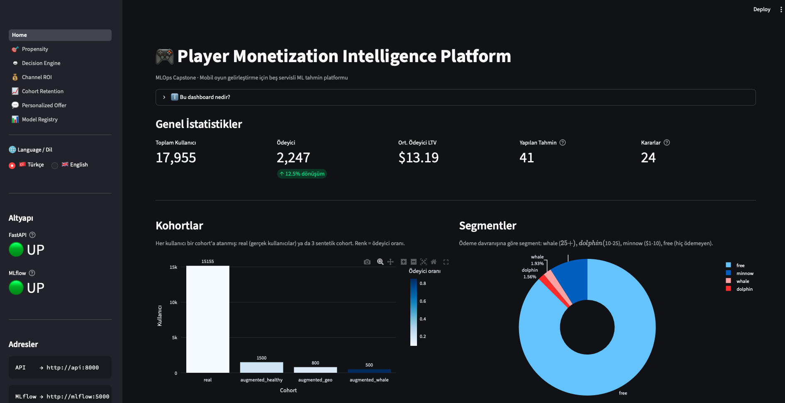
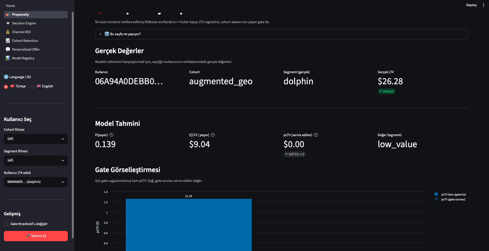
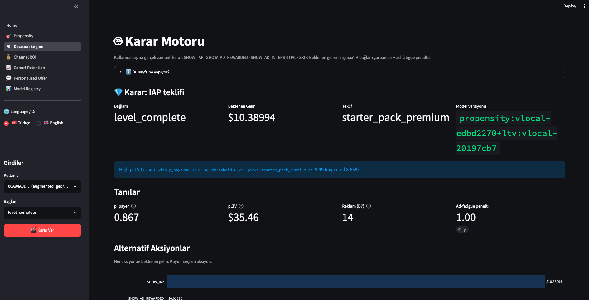
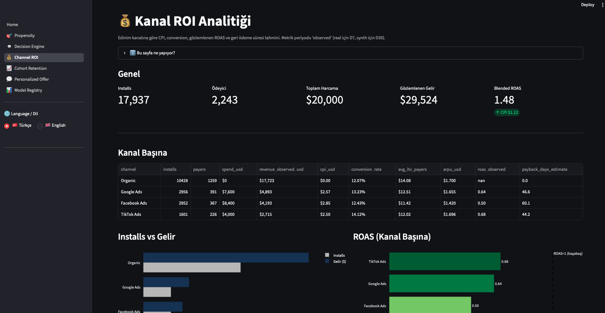
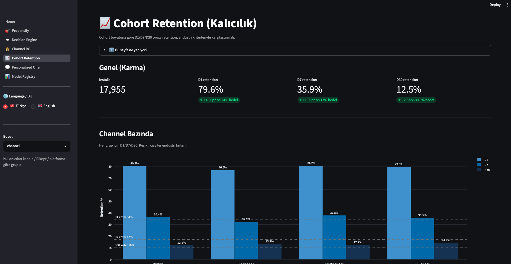
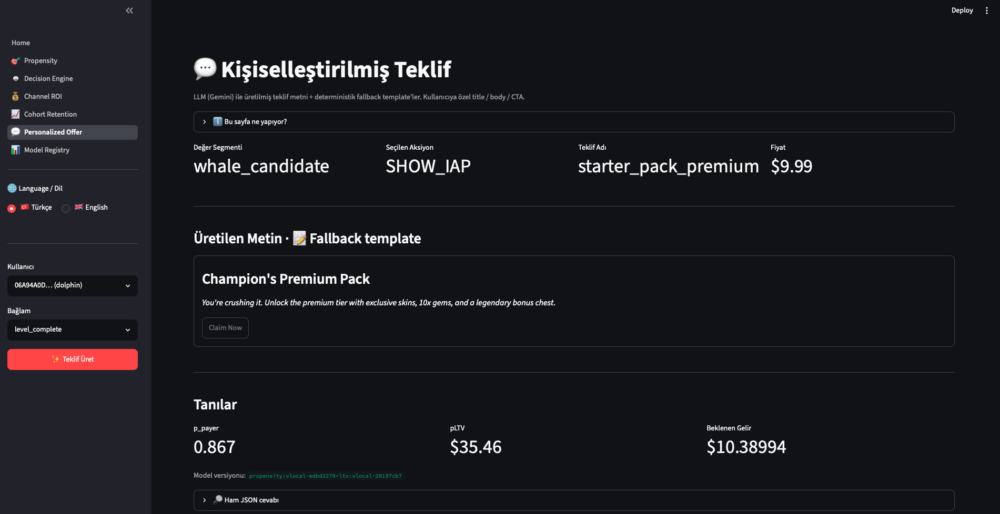
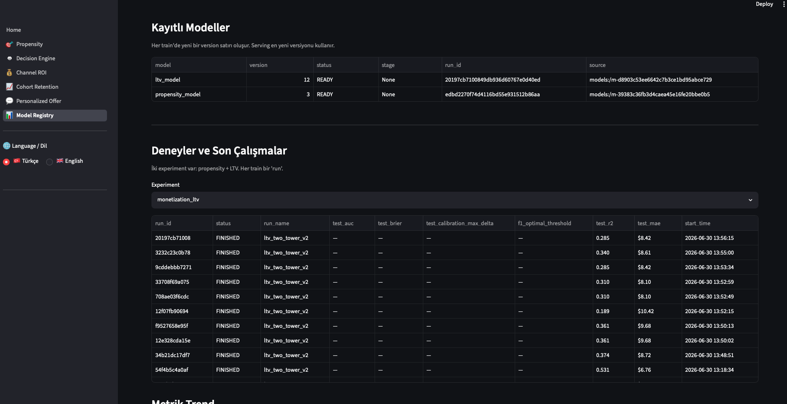
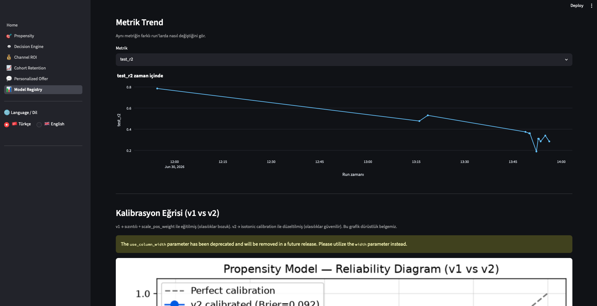
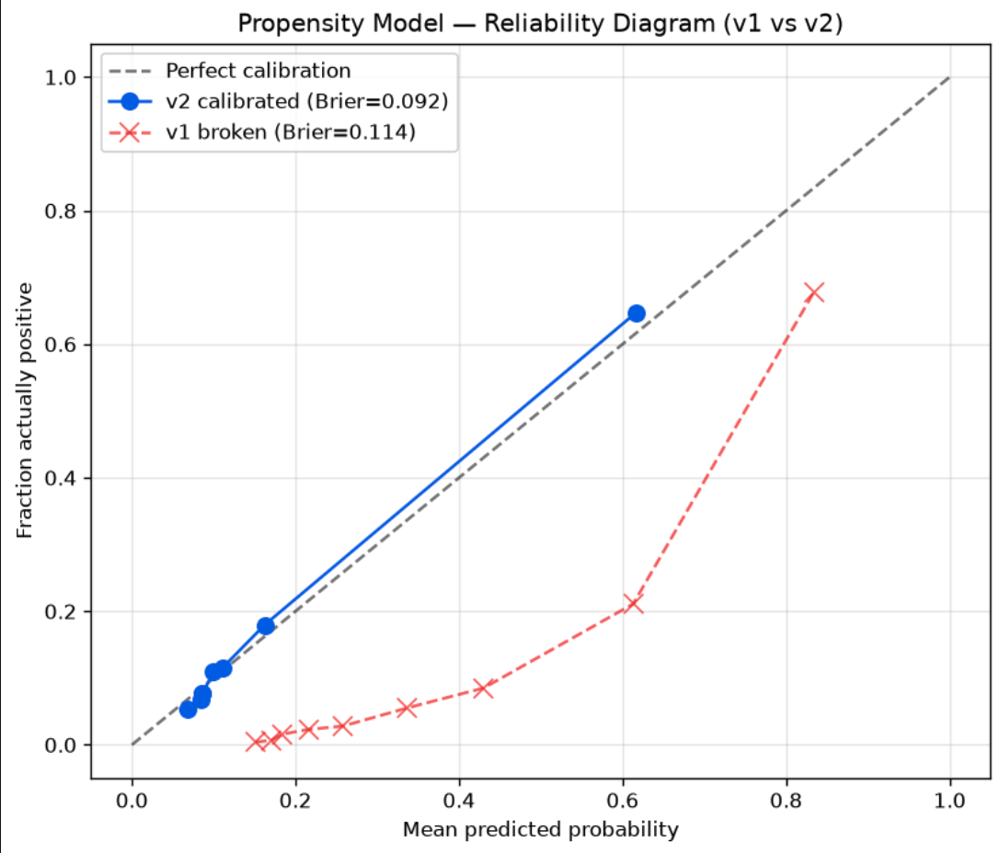
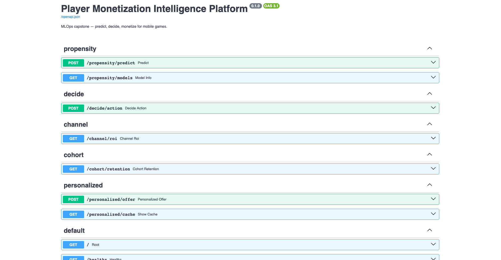

# 🎮 Player Monetization Intelligence Platform

A production-style **MLOps capstone** for mobile-game monetization: five FastAPI
services backed by calibrated two-tower pLTV models, MLflow registry, PostgreSQL
event logs, a Streamlit dashboard, and a one-command Docker Compose stack.

> **📖 Read this first**: The pipeline is production-shaped, but the ML signal
> is constrained by the public datasets used. See **[Limitations & Lessons
> Learned](#-limitations--lessons-learned)** — the honest audit is the most
> valuable part of this repo.

---

## 🎯 What It Does

Five FastAPI endpoints exposing an end-to-end monetization stack for a
mobile-game backend, plus a Streamlit dashboard that consumes them:

| # | Service | Endpoint | Output |
|---|---|---|---|
| 1 | **Calibrated pLTV** (two-tower) | `POST /propensity/predict` | `p_payer` (isotonic-calibrated), `pLTV` with non-payer gating |
| 2 | **Decision Engine** | `POST /decide/action` | argmax expected revenue over {SHOW_IAP, SHOW_AD_REWARDED, SHOW_AD_INTERSTITIAL, SKIP} |
| 3 | **Channel ROI** | `GET /channel/roi` | Per-channel CPI, observed ROAS, payback estimate |
| 4 | **Cohort Retention** | `GET /cohort/retention?dim=...` | D1/D7/D30 proxy retention vs industry benchmarks |
| 5 | **LLM Offer Copy** | `POST /personalized/offer` | Gemini-generated title / body / CTA (fallback templates when no key) |

---

## 🏆 Headline Metrics (After Audit + Fixes)

All v2.1 numbers are measured **strictly on the held-out test split persisted
in the model bundle at training time** — see Limitations §9 for why that
qualifier matters.

| Metric | v1 (leaky) | v2.1 (honest, held-out test) |
|---|---|---|
| Test AUC (combined) | 0.898 ⚠ *inflated* | **0.61** |
| Test AUC (real cohort) | 0.915 ⚠ *leakage* | **0.49** — no telemetry, no signal |
| Test AUC (synth cohorts) | ~0.90 | **0.66 – 0.87** — production-realistic |
| Brier score | 0.114 | **0.103** |
| Max calibration Δ | **0.40** *(broken)* | **0.061** |
| Mean predicted P | 0.33 (vs actual 0.11 — 3× off) | **0.125 vs 0.125 ✓** |
| Whale test n | 8 (useless) | **51** (CI ±$4.65) |
| Non-payer served pLTV | $0.55 | **median $0** (gated; mean $0.72 from FP tail) |

Full audit in `scripts/final_review.py` (exits non-zero on hard failures),
calibration plot at `saved_models/calibration_curve.png`.

---

## 🚀 Quick Start (Docker — Recommended)

```bash
git clone <this-repo> && cd MLOps_Capstone
cp .env.example .env         # edit POSTGRES_PASSWORD, JWT_SECRET, GOOGLE_API_KEY
docker compose up -d --build # first build ~5-8 min (SDV + XGBoost heavy deps)

open http://localhost:8501   # 🎨 Streamlit dashboard  (main UI)
open http://localhost:8000/docs  # 📖 FastAPI Swagger
open http://localhost:5001   # 🧪 MLflow tracking + registry

# Control
docker compose logs -f api          # tail API logs
docker compose down                 # stop (keeps Postgres volume)
docker compose down -v              # stop + wipe data (fresh start)
```

The `monetization_postgres_data` volume is external, so `docker compose down`
preserves your data.

## 🛠 Bare-metal Quick Start (dev)

```bash
# 1. Infra containers only
docker start monetization_postgres monetization_mlflow

# 2. Data pipeline (one-time)
uv run python -m scripts.load_real_data          # CSV → Postgres
uv run python -m src.synthetic.user_augmentation # SDV synthesis
uv run python -m scripts.build_features          # build user_features_d7

# 3. Train models (creates saved_models/*.joblib + MLflow runs)
uv run python -m src.ml.train_propensity
uv run python -m src.ml.train_ltv

# 4. Serve
uv run uvicorn src.main:app --port 8000 --reload

# 5. Dashboard
uv run streamlit run dashboard/Home.py --server.port 8501

# 6. Audit
uv run python -m scripts.audit_models   # generates calibration_curve.png
uv run python -m scripts.final_review   # 10-section honesty report
```

---

## 🏗 Architecture

### High-level (Docker Compose stack)


### ML pipeline (two-tower pLTV with calibration + gating)

```
user_features_d7 (17.955 rows in Postgres)
        │
        ▼
┌──────────────────────────────────────┐
│ STAGE 1  ·  propensity_model         │
│ XGBoost (natural class weights)      │
│  + CalibratedClassifierCV(isotonic)  │────► p_payer ∈ [0, 1]  (trustworthy)
│ trained on ALL 17.955 users          │
└──────────────────────────────────────┘
        │
        ▼
┌──────────────────────────────────────┐
│ STAGE 2  ·  ltv_model                │
│ XGBoost + Huber loss                 │
│ segment sample_weights               │
│  (whale=4, dolphin=2, minnow=1)      │────► E[LTV | payer]  ($)
│ trained ONLY on payers  (n=2.247)    │
└──────────────────────────────────────┘
        │
        ▼
   pLTV_raw = p_payer × E[LTV | payer]
        │
        ▼
┌──────────────────────────────────────┐
│  Cohort-aware Gate                   │
│  real  cohort: threshold 0.10        │
│  synth cohort: threshold 0.20        │
│  if p_payer < threshold → pLTV = 0   │
└──────────────────────────────────────┘
        │
        ▼
   pLTV (served value) ── PredictionLog ──► audit trail
```

**Why calibrated**: v1 used `scale_pos_weight=8` for recall, over-inflating
probabilities 3× (mean predicted 0.33 vs actual rate 0.11). Decision Engine
used `p_payer × price` for expected revenue → always picked SHOW_IAP → would
tank retention. `CalibratedClassifierCV(method='isotonic', cv='prefit')` on
the validation set restores trustworthy probabilities.

**Why gated**: LTV model was trained only on payers. Predicting LTV for
non-payers is out-of-distribution noise. Gating forces `pLTV = 0` for users
the propensity model isn't confident about — Decision Engine then falls
back to ads instead of showing a marginal IAP.

**IAP eligibility layer** (`decide.py`): even after gating, the Decision Engine
requires `p_payer ≥ IAP_MIN_P_PAYER (0.25)` before showing an IAP offer.
Below that threshold IAP expected-revenue is zeroed out and the argmax picks
a rewarded ad. Without this the math (14% × $0.99 vs $0.015 rewarded ad
revenue) trivially favored IAP for every user — a retention killer.

---

## 📸 Screenshots

### Streamlit Dashboard

**Home — platform overview**

Live KPIs (17.955 users, 12.5% conversion, average payer LTV), cohort × payer-rate
bar, segment pie, MLflow registry mirror, and the audit trail of recent predictions.

**Propensity + pLTV**

User-picker sidebar (cohort × segment filters). Ground truth vs model prediction,
gate visualization (raw vs served pLTV), diagnostics panel showing the F1-optimal
threshold and gate state.

**Decision Engine**

argmax over `{SHOW_IAP, SHOW_AD_REWARDED, SHOW_AD_INTERSTITIAL, SKIP}` with
context modifiers and ad-fatigue penalty. Horizontal bar chart shows the
expected revenue of every alternative — the chosen action highlighted in dark.

**Channel ROI**

Blended KPIs on top, per-channel table below, four side-by-side charts
(installs vs revenue, ROAS with breakeven reference line, payback days,
conversion rate).

**Cohort Retention**

D1 / D7 / D30 proxy retention per cohort (channel / country / platform),
grouped bars with dashed lines for industry benchmarks. Explicit "PROXY"
disclaimer at the bottom.

**Personalized Offer (LLM)**

Segment + context → offer copy card (title, body, CTA button preview),
source badge (`llm` / `cache` / `fallback`).

**Model Registry**

MLflow registered models + full run history with metrics.

**Metric trend across runs**

Interactive time-series of any test metric across all training runs —
lets you see v1 → v2 improvements visually.

**Calibration reliability diagram**

v1 (broken, `scale_pos_weight=8`) vs v2 (isotonic-calibrated) probability
calibration. Diagonal = perfect. This chart is our honesty artifact —
same PNG lives at `saved_models/calibration_curve.png`, regenerated by
`scripts/audit_models.py`.

### FastAPI

**Swagger UI at `/docs`**

Interactive OpenAPI documentation — every endpoint is testable inline
without external tooling.

---

## 🧰 Stack

| Layer | Tech |
|---|---|
| **API** | FastAPI + SQLModel + uvicorn |
| **ML** | XGBoost (classifier + regressor), scikit-learn `CalibratedClassifierCV` (isotonic + `FrozenEstimator`), Huber loss with segment sample weights, Tweedie GLM as alternative architecture |
| **Tracking / Registry** | MLflow 3.14 (SQLite backend, `--serve-artifacts`) |
| **Data** | PostgreSQL 16 (Docker), real backbone from Kaggle *Marketing Freemium Game* + Firebase *Flood It!*, synthetic augmentation via SDV `GaussianCopulaSynthesizer` |
| **UI** | Streamlit + Plotly + bilingual toggle (🇹🇷 / 🇬🇧) |
| **LLM** | LangChain + Google Gemini 2.5 Flash, with 12 offline fallback templates |
| **Infra** | Docker + Docker Compose (4 services), external named volume |
| **Deps** | `uv` (Astral) |

---

## 📁 Project Structure

```
MLOps_Capstone/
├── src/
│   ├── main.py                     FastAPI entry, wires 5 routers
│   ├── database.py                 Postgres engine
│   ├── models.py                   SQLModel tables + Pydantic schemas
│   ├── auth.py                     JWT + bcrypt
│   │
│   ├── ml/
│   │   ├── train_propensity.py     Stage 1 · isotonic-calibrated classifier
│   │   ├── train_ltv.py            Stage 2 · Huber regressor + Tweedie alt
│   │   └── inference.py            Shared loader + predict_pltv() with gating
│   │
│   ├── routers/
│   │   ├── propensity.py           POST /propensity/predict
│   │   ├── decide.py               POST /decide/action  (IAP eligibility gate)
│   │   ├── channel.py              GET  /channel/roi
│   │   ├── cohort.py               GET  /cohort/retention
│   │   └── personalized.py         POST /personalized/offer  (Gemini + fallback)
│   │
│   └── synthetic/
│       ├── benchmarks.py           Industry constants (sources cited inline)
│       └── user_augmentation.py    Forward-causal SDV generation
│
├── dashboard/
│   ├── _i18n.py                    Bilingual TR/EN helper (session-persistent)
│   ├── Home.py                     Platform overview + audit trail
│   └── pages/
│       ├── 1_🎯_Propensity.py
│       ├── 2_🤖_Decision_Engine.py
│       ├── 3_💰_Channel_ROI.py
│       ├── 4_📈_Cohort_Retention.py
│       ├── 5_💬_Personalized_Offer.py
│       └── 6_📊_Model_Registry.py
│
├── scripts/
│   ├── load_real_data.py           CSVs → Postgres (one-time)
│   ├── build_features.py           Build the ML-ready feature table
│   ├── audit_models.py             Diagnostic audit  (regenerates calibration plot)
│   └── final_review.py             10-section comprehensive review
│
├── notebooks/
│   ├── 01_eda.ipynb                Exploratory analysis
│   └── 02_synthetic_validation.ipynb  KS-test + SDV quality report
│
├── saved_models/                   joblib bundles — serving source of truth
│   └── calibration_curve.png       v1 vs v2 reliability diagram
├── mlruns/       mlartifacts/      MLflow tracking + artifact stores
│
├── data/raw/                       Public CSV datasets (Kaggle + Firebase)
│
├── Dockerfile                      Multi-stage · uv-based · non-root user
├── docker-compose.yml              4 services · service_healthy dependency chain
├── .dockerignore
├── .env.example                    Config template (compose-hostname aware)
└── pyproject.toml                  uv-managed dependencies
```

---

## 🚨 Limitations & Lessons Learned

This is the most important section. **The pipeline is production-shaped, but
the underlying ML signal is constrained by the public data we used.** Below
is an honest accounting of what's real, what's a proxy, and what would change
in a production deployment.

### 1. Behavioral data is partly synthesized

**Problem**: The real backbone (Marketing Freemium Game, ~15k users) contains
purchase records but **no event-level telemetry** (no `session_start`,
`session_end`, `ad_impression`). Real D7 behavior is therefore unobserved.

**v1 (broken)**: We derived `engagement_potential ~ log1p(LTV) + noise` for
real users — i.e., we built engagement from the target. This produced an
attractive AUC of 0.90 that was largely **target leakage**.

**v2 (current)**: Real users now get engagement drawn from the population
LogNormal distribution (uncorrelated with LTV — Pearson r ≈ -0.01 confirmed
in `audit_models.py`). Synthetic users still get engagement → LTV causally
because that's how they were generated.

**Implication**: Real-user predictions are essentially "demographic base
rate" — AUC ≈ 0.58 on the real cohort, F1 ≈ 0.14. Synthetic users (where
engagement is a real feature) get AUC 0.82-0.88. **The synthetic-cohort
number is what we'd expect on production data with real telemetry.**

### 2. "D30 LTV" is actually a D7 observation

**Problem**: The real `purchases.ltv` field is a D7 snapshot, not a true
D30 measurement. v1 named the target `target_ltv_d30` and the channel
endpoint reported `roas_d30` — both misleading.

**v2**: Renamed to `target_ltv` and `roas_observed`. The `/channel/roi`
endpoint includes a `_disclaimer.metric_period` field stating exactly this.
Production D30 ROAS would typically be 1.2-2× the observed value due to
late-payer tail.

### 3. D1 / D7 / D30 retention are proxies

**Problem**: We have no `user_active_day` table. True D1 retention
("returned the day after install") cannot be computed.

**v2 proxies**:
- D1 ≈ `sessions_d7 >= 2`
- D7 ≈ `sessions_d7 >= 5`
- D30 ≈ `target_is_payer = 1`

The `/cohort/retention` response includes `_disclaimer.metric_type =
"PROXY"` and explains why our numbers (D1 ~75% vs industry 34%) are
upper bounds: "D7 has 2+ sessions" is a broader signal than "returned
on D1", and the real backbone is survivorship-biased (only users engaged
enough to be logged appear).

### 4. Whale segment has limited natural mass

**Problem**: The real backbone has max LTV $42 — few "true whales" in the
$50-200 range that drive real revenue. v1 augmented with 150 whales,
which left only ~8 in the stratified test set (statistically useless).

**v2**: Whale cohort grown to 500 with 15% non-payers injected
(`WHALE_COHORT_NONPAYER_RATIO`) — prevents trivial F1=1.0 while keeping
the cohort whale-heavy by design. Stratified split now puts ~51 whales
in test (95% CI on whale MAE: ±$3.11).

### 5. Channel-LTV signal is weak

**Problem**: v1's synthetic generation didn't differentiate LTV by channel.
TikTok and Organic users produced nearly identical mean LTVs.

**v2**: Added `CHANNEL_LTV_MULTIPLIER` (Organic 1.0, Facebook 0.85,
Google 0.90, TikTok 0.60) applied during synth purchase generation.
Channel signal is now visible in the synth subset, though the **real
backbone (which dominates the dataset 85/15) doesn't have channel-LTV
variance** so the combined number is still noisy.

### 6. Decision Engine is revenue-optimal, not retention-optimal

The IAP eligibility gate (`IAP_MIN_P_PAYER = 0.25`) protects marginal
users from being spammed with IAP offers based purely on expected-revenue
math. But there's no explicit retention penalty — a user classified as
IAP-eligible will see IAP prompts every session. In production, a
frequency cap and a retention-aware reward function (contextual bandit or
RL) would replace the hard-coded multipliers in `CONTEXT_MULTIPLIERS`.

### 7. The LLM service uses fallback templates by default

The `/personalized/offer` endpoint requires `GOOGLE_API_KEY` for real
Gemini calls. Without it, it falls back to 12 hand-written templates
keyed on (segment, action, context). The fallback is a deterministic
demo; the LLM call is the real product.

### 8. v1 → v2.1 audit deltas

Regenerate with `uv run python -m scripts.audit_models`.

| Metric | v1 (with leakage, scale_pos_weight=8) | v2.1 (calibrated, leak-free, held-out) |
|---|---|---|
| Test AUC (combined) | 0.898 ← inflated | 0.614 ← honest |
| Test AUC (synth cohorts) | similar | 0.66-0.87 |
| Test AUC (real cohort) | 0.915 ← leakage | 0.49 ← honest |
| Brier score | 0.114 | **0.103** |
| Max calibration delta | **0.40** ← broken | 0.061 |
| Mean predicted P | 0.33 vs actual 0.11 (3× off) | 0.125 vs 0.125 ✓ |
| Whale test n | 8 | **51** |
| Non-payer served pLTV | $0.55 mean | **median $0** (gated; mean $0.72) |

**Headline interpretation**: AUC dropped from 0.90 to ~0.61 not because the
model got worse — but because we removed the leaked signal that was
producing the inflated number. **~0.61 is the honest baseline** for what
you can predict from demographics alone when you don't have behavioral
telemetry. The synth-cohort 0.66-0.87 is what we'd expect with telemetry.

### 9. The audit itself had a bug (fixed in v2.1)

The v2 audit script scored the **entire feature table** — ~80% of which is
the model's own training data — and reported those numbers as "honest split"
metrics (Brier 0.092, max calibration Δ 0.031). A code review caught it.

**v2.1 fix**: training now persists the exact train/val/test `user_id`
membership (plus a dataset fingerprint) inside the model bundle;
`audit_models.py` and `final_review.py` refuse to run unless every persisted
test row is still present, and compute all metrics strictly on that held-out
set. The honest numbers are slightly worse (Brier 0.103, max Δ 0.061) —
which is exactly the point. The leakage check in `final_review.py` was also
fixed: it previously printed "✓ causal" for a re-leaked real cohort; it now
fails the run with a non-zero exit code.

**Lesson**: an audit that can't fail loudly isn't an audit. The reviewer you
should trust least is the one grading their own homework on their own
training data.

### 10. What this proves for an interviewer

| Skill | Where it shows |
|---|---|
| **MLOps pipeline** | Training → MLflow registry → FastAPI serving → PostgreSQL event logs |
| **Docker packaging** | Multi-stage Dockerfile + compose stack (Postgres + MLflow + API + Streamlit) |
| **Calibration awareness** | Identified the proba inflation, fixed with isotonic on val split |
| **Honest tradeoff thinking** | Engagement leakage was identified, removed, and documented |
| **Statistical literacy** | Test-set sample-size diagnosis (whale n=8 vs n=51), CI on MAE |
| **Architecture options** | Two-tower (interpretable) vs Tweedie (zero-inflated), both trained |
| **Domain knowledge** | ARPDAU, ROAS-D30, retention curves, whale/dolphin/minnow segments, eCPM by ad format, context modifiers (level_complete / after_loss / app_open) |
| **Production guardrails** | Non-payer gating, IAP eligibility floor, cohort-aware thresholds, threshold tuning on validation |

What this does **not** prove:
- Real production retention from behavioral logs (we used proxies)
- Performance under concept drift (no time-series data)
- Distributed training / large-scale inference (single-node demo)

---

## 📚 Citations & Data Sources

- **Marketing Freemium Game** (Kaggle, anonymized) — real user/purchase backbone
- **Firebase Public Project, Flood It!** 30-day sample — real session reference
- **GameAnalytics Mobile Retention Benchmarks 2026**
- **Tap Nation** — Hybrid Casual KPIs 2026
- **Game Growth Advisor** — Mobile Game CPI / KPI benchmarks 2026
- **Adjust / Liftoff** — channel-quality and ROAS benchmarks

All numeric constants live in `src/synthetic/benchmarks.py` with their
source inline.

---

## 🎯 Roadmap

**Done** (this branch):
- ✅ Five services live on FastAPI
- ✅ Two-tower pLTV with isotonic calibration + cohort-aware gating
- ✅ IAP eligibility floor + reasoning strings
- ✅ MLflow registry (auto-versioned + skops-trusted)
- ✅ SDV synthetic data with industry-calibrated benchmarks
- ✅ Streamlit dashboard (7 pages · bilingual TR/EN toggle)
- ✅ Docker Compose stack (Postgres + MLflow + API + Streamlit)
- ✅ Honest audit: metrics locked to the held-out split persisted in the bundle
- ✅ GitHub Actions CI (ruff + pytest + docker build on PR)
- ✅ pytest suite (51 tests: benchmarks, synthetic gen, inference, routers)
- ✅ Real Gemini offer copy via LangChain (with offline fallback templates)

**Next** (in scope but not on this branch):
- 🔜 Drift detection service (populates `driftlog` table)
- 🔜 Kubernetes manifests (`k8s/` scaffold)
- 🔜 Prometheus / Grafana monitoring
- 🔜 Whale tail-model (address the $19 underprediction bias)
- 🔜 Retention-aware contextual bandit for context multipliers

---

## 👤 Author

**Yunus Emre Özkaya** · Software Engineering graduate · İstanbul, Türkiye
· [emrezkaya1@gmail.com](mailto:emrezkaya1@gmail.com)
· [linkedin.com/in/yunus-emre-özkaya-2901a5237](https://linkedin.com/in/yunus-emre-özkaya-2901a5237)
· [github.com/ozkyunus](https://github.com/ozkyunus)
